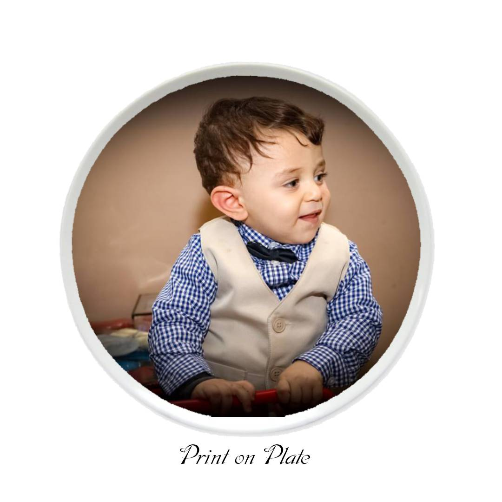
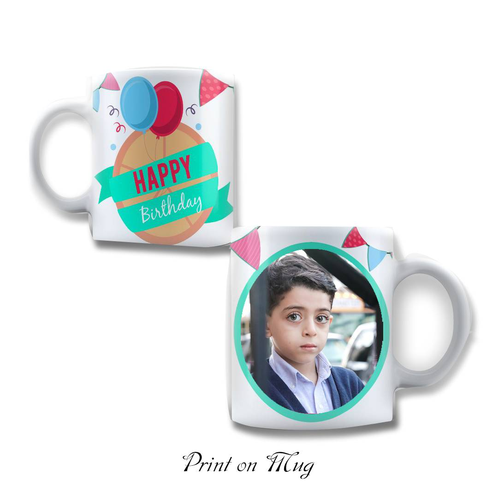
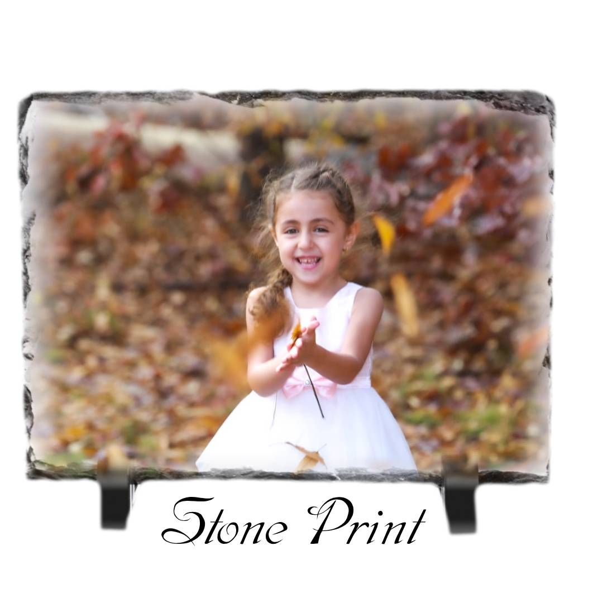

<html lang="en">
<head>
  <meta charset="UTF-8">
  <meta name="viewport" content="width=device-width, initial-scale=1.0">
  <title>Your Gift From Us</title>
  <link rel="stylesheet" href="styles.css">
</head>
<body>
  <!-- Header Section -->
  <header>
    <!-- Logo and Title -->
    

      
      <h1>Your Gift From Us</h1>
    

    <!-- Navigation List -->
    <nav>
      <ul class="horizontal-list">
        <li><a href="home.html">Home</a></li>
        <li><a href="myproduct.html">My Product</a></li>
        <li><a href="contact us.html ">Contact Us</a></li>
      </ul>
    </nav>
  </header>

  <!-- Main Content Section -->
  <main>

    <section class="home-page">
      <h2>We Have the Largest Selection of Unique Gift Ideas</h2>
      

        Because you can present your gift with beautiful memories and words.
        By printing a sweet memory on a mug, plate, or frame, or engraving it on wood for an occasion that suits you (your birthday - Christmas - Easter - Valentine's Day - wedding anniversary - graduation). For every occasion, you will find your gift.
      

      <!-- Username and Password Input Fields -->
      

        <label for="username">Username:</label>
        <input type="text" id="username" name="username" placeholder="Enter your username">

        <label for="password">Password:</label>
        <input type="password" id="password" name="password" placeholder="Enter your password">

        <button type="submit">Login</button>
      

	  <h2>Customize Your Gift</h2>
      

        Use the field below to add a personalized message or notes for your gift. 
      

      <textarea id="output-area" placeholder="Enter your personalized message or notes here..."></textarea>
    </section>

    <!-- Right Side: Photo Gallery -->
    <section class="photo-gallery">
      <h2>Our Work</h2>
      

         
        
        
       
      

    </section>

    
  </main>

  <!-- Footer Section -->
  <footer>
    
Design Gift for You

  </footer>
</body>
</html>
